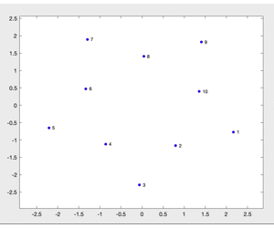
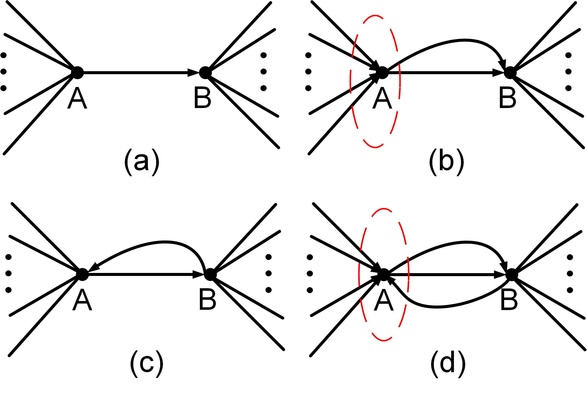
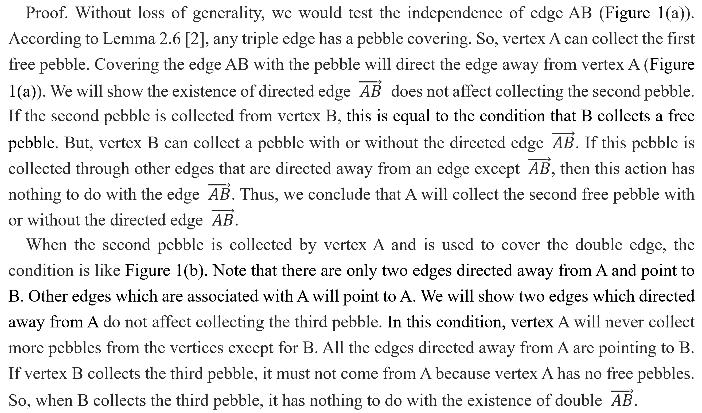
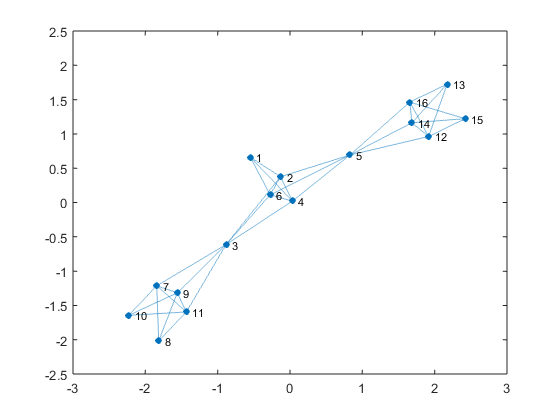
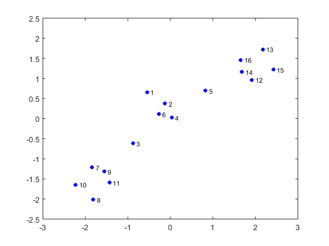
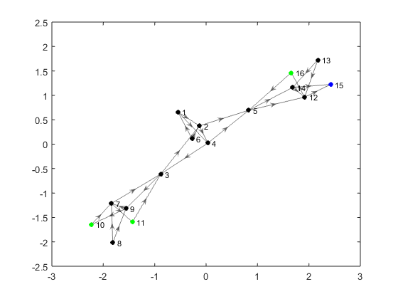
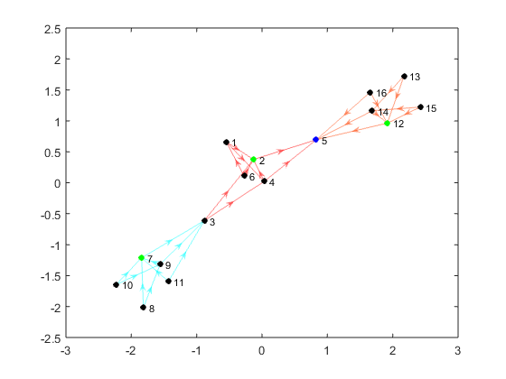

# **A MATLAB Toolbox for Two-Dimensional Rigidity Percolation: The Pebble Game**

## **Preface**

Welcome to MATLAB toolbox for 2D rigidity percolation. The generical rigidity of
graphs plays an essential role in the field of sensor network location. Jacobs
et al. provided an exciting and effective method that uses pebble games to
percolate the rigidity of a network [2]. To meet the need of research and
teaching on MATLAB, we implement the algorithm and build a toolbox. The
implementation disassembles the pebble game into elemental actions, which
provides interactivity and reusability. Benefitting from the build-in graph
operation from MATLAB, the toolbox has good compatibility. The practice shows
the following convenience:

-   Analyzing the rigidity of a network with less than ten lines of code.

-   Observing the work of pebble games step by step.

-   Never generating extra variables to contaminate workspace.

-   Generating good figures for papers.

We sincerely hope our toolbox facilitates research and teaching. Any
suggestions, corrections, and improvements are welcome.

Please Email: [bluebirdhouse@me.com](mailto:bluebirdhouse@me.com)

***  

## **Concepts**

Pebbling is a game that involves placing pebbles on the vertices of a directed
acyclic graph according to specific rules [1]. When the pebble game is used to
percolate the rigidity of 2D generic networks, the rules are as follows. Each
vertex is given two pebbles. The edges are added to the graph one at a time, and
pebbles are rearranged to cover the edge. First, we look at the vertices that
incident to the newly added edge. If either vertex has a free pebble, then use
it to cover the edge. In the meantime, the edge is directed away from the vertex
that offers a pebble. If neither of them has free pebbles, their pebbles must
have been used to cover existing edges. We should try to free up a pebble for
the newly added edge. If a vertex at the other end of existing edges has a free
pebble, then that pebble can cover the associated edge. The swap will free up a
pebble. More formally, we are searching for a free pebble that follows the
directions of edges. This search of a free pebble continues until either a
pebble is found and a sequence of swaps allows the new edge to be covered, or
else no more vertices can be reached and no free pebbles have been discovered.
If we fail to find a free pebble, the new edge will be removed and play no roles
in pebble games.

Two tasks should be accomplished when percolating the rigidity of a 2D generic
network: identifying independent edges and exploring rigid clusters.

The first task starts from a graph that contains no edge. We randomly add one
edge that should be tested to the graph and quadruple the edge; then, four edges
are added to the graph one after another to find pebble covering. If four edges
are all covered by pebbles, three will be removed from the graph. The left one
is an independent edge. If not, we remove all of them and mark the edge
redundant.

After every edge is tested, rigid clusters will be explored. Since an
independent edge can only belong to one rigid cluster, the triple edge will
exhaust three free pebbles of the current rigid cluster. Any vertex that belongs
to the same rigid cluster will not collect pebbles from the associated two
vertices. The edges between two vertices that fail to find a free pebble are
marked as the same rigid cluster.

Our toolbox differs from the work [2] in two ways. The toolbox performs a
breadth-first search; then, it moves through the search results to find a free
pebble. This strategy finds free pebbles faster and is easier to program, but it
will consume more memory. Furthermore, we believe that pinning free pebbles at a
vertex is equivalent to using free pebbles to cover the edge (Theorem 1). Thus,
we pin three pebbles and use the fourth one to cover the edge rather than cover
quadruple edges. We will improve this claim.

**Theorem 1**. *Pinning free pebbles at a vertex is equivalent to using free
pebbles to cover the edge associated with the vertex.*

 Figure 1: Testing an independent edge.

If a pebble from vertex B covers the double edge, the condition is similar to
Figure 1(c). In this condition, freeing a pebble from A to B will lead to the
condition of Figure 1(b). However, if the third pebble is collected through
other paths, the collection has nothing to do with directed edges between A and
B.

Two pebbles from vertex A and one from vertex B have been used to cover tripled
edges in the last condition (Figure 1(d)). The fourth pebble can only be
collected by vertex B and will not from vertex A. The existed three directed
edges between A and B do not affect vertex B collecting pebbles.

Since the directed edges between vertex A and vertex B will not affect
collecting more pebbles, we can pin pebbles on the vertices rather than covering
the first, double, and triple edges.

**Q.E.D.**

***  

## **Examples and How-To**

The toolbox is based on the build-in graph operation of MATLAB, so it should be
compatible with version 7.6 and later. The user may add toolbox files to
MATLAB’s search path with m-file ‘SetPath.’ There are examples in the
toolbox to play with; then, users get out to build personal stage of pebble
game.

###  **Building the Pebble Game Play Stage**

The interface of `PebbleGamePlayStage` is the same as the function `graph`,
which is a built-in MATLAB class. The first step is to create a table that
contains a variable `EndNodes`, such as:

    T1 = [1 2; 1 4; 1 6; 2 3; 2 4; 2 5; 2 6; 3 4; 3 6; 4 5; 4 6; 5 6];
    T2 = [3 7; 3 9; 3 11; 7 8; 7 9; 7 10; 7 11; 8 9; 8 11; 9 10; 9 11; 10 11];
    T3 = [5 12; 5 14; 5 16; 12 13; 12 14; 12 15; 12 16; 13 14; 13 16; 14 15; 14 16; 15 16];
    T = [T1;T2;T3]; 
    EdgeTable = table(T,'VariableNames',{'EndNodes'});

The table is used as the parameter to instantiate `PebbleGamePlayStage`.

    PebbleGame = PebbleGamePlayStage(EdgeTable); 

Then, store two associated vertices of an edge into different matrices.

    s = [1 1 1 2 2 2 2 3 3 4 4 5];
    t = [2 4 6 3 4 5 6 4 6 5 6 6];
    PebbleGame = PebbleGamePlayStage(s,t);

When the instantiation `PebbleGame` is created, the class `UserInPut_Group`
is instantiated automatically. Its handle is copied to `PebbleGame.UserInPut`.
This class shows the user’s input and provides data for instantiating
`Operation_Group`. The latter, whose handle is `PebbleGame.Operation`,
identifies independent edges and explores rigid clusters. The MATLAB will pop up
two figures, such as Figure 2 and Figure 3. One shows the user’s input, the
other displays the process of the pebble game.

Figure 2: An example of user’s input graph. It is used to confirm the input or
be treated as a reference during the pebble game.

Figure 3: An Example of the initial status of a pebble game. No edge has been
added to the graph yet. The vertices are painted blue, which means each vertex
has two free pebbles.

### **Playing Pebble Games**

The toolbox contains multiple functions to customize pebble games. However, if
the user prefers identifying independent edges with the classic pebble game [2],
only one function should be enough.

    for i = 1:1:(12*3)
        PebbleGame.Operation.IndependentEdge(1)
        drawnow();
    end
Each time the function `IndependentEdge` is called, it picks an edge from
`PebbleGame.Operation.EdgeReadyForAdd` and try to find a free pebble to cover
it. If the edge is independent, the function adds it to the graph; otherwise,
the function adds it to `PebbleGame.Operation.EdgeUnableAdd`. Eventually, the
graph will be like Figure 4.

Figure 4: Pebbles covering all the independent edges. Their edges are directed
away from the vertices that offer the pebbles. Most of the vertices use up their
free pebbles and change color to black. Three greens remain one pebble.
Redundant edges are missing because they play no roles in pebble covering.

   

### **Identifying Rigid Clusters and Coloring Them**

Before exploring rigid clusters, the user executes function
`StartIdentifyRigidCluster` to get the toolbox ready.

    PebbleGame.Operation.StartIdentifyRigidCluster();

The code below explores rigid clusters as many as there are.

    while(PebbleGame.Operation.IdentifyARigidCluster() == false)
        PebbleGame.Operation.ShowRigidCluster();
        drawnow();
    end

As shown in Figure 5, the function `ShowRigidCluster` can color the rigid
clusters. Use `drawnow` wisely to show a dynamic figure.

Figure 5: Rigid clusters are identified and colored.

***
##  **Acknowledgments**

-   The toolbox uses a class `ArrayList` from an excellent MATLAB-based robot
    software Sim.I.am [3].

-   The suggestion of professor Jacobs, which is to build an easy-to-use
    interface, gave us confidence about the work.

-   Professor Hongxia Wang gave attention and encouragement during the software
    development.

-   Professor Li Yu provided financial support when the software was registered.

-   This work is supported by the Key Programs of the Natural Science Foundation
    of Zhejiang Province under Grant LZ15F030003.

***

##  **References**

[1] Wikipedia contributors. Pebble game [Internet]. Wikipedia, The Free
Encyclopedia; 2015 Jul 27, 10:50 UTC [cited 2016 Jan 25]. Available from:
<https://en.wikipedia.org/w/index.php?title=Pebble_game&oldid=673286933>.

[2] D. J. Jacobs and B. Hendrickson, "An algorithm for two-dimensional rigidity
percolation: the pebble game," *Journal of Computational Physics,* vol. 137, pp.
346-365, 1997.

[3] J. P. d. l. Croix. (2013). *Sim.I.am*. Available:
http://jpdelacroix.com/simiam/
